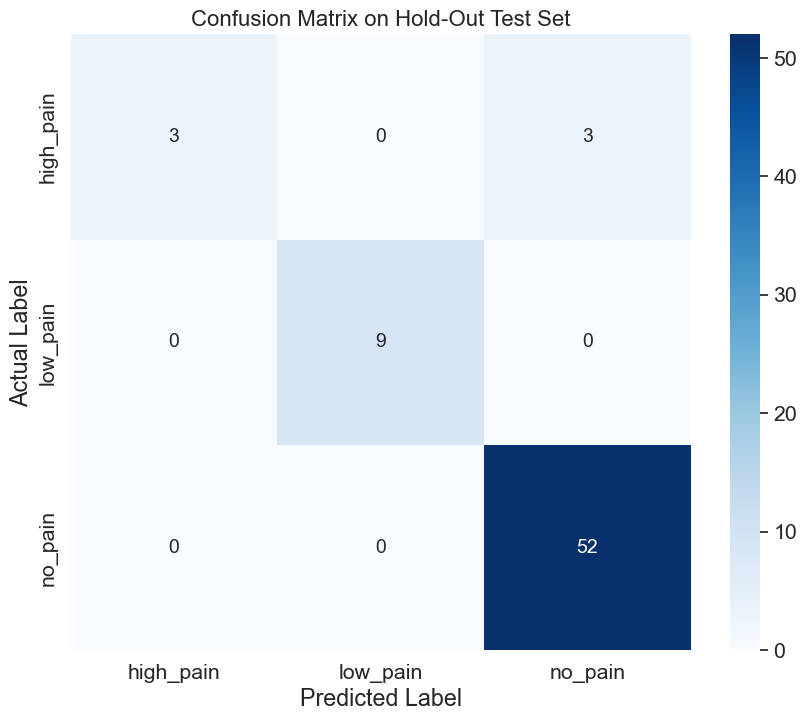
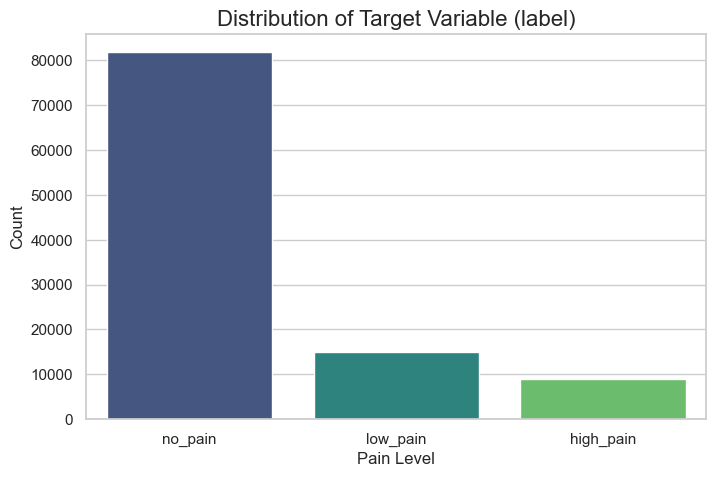
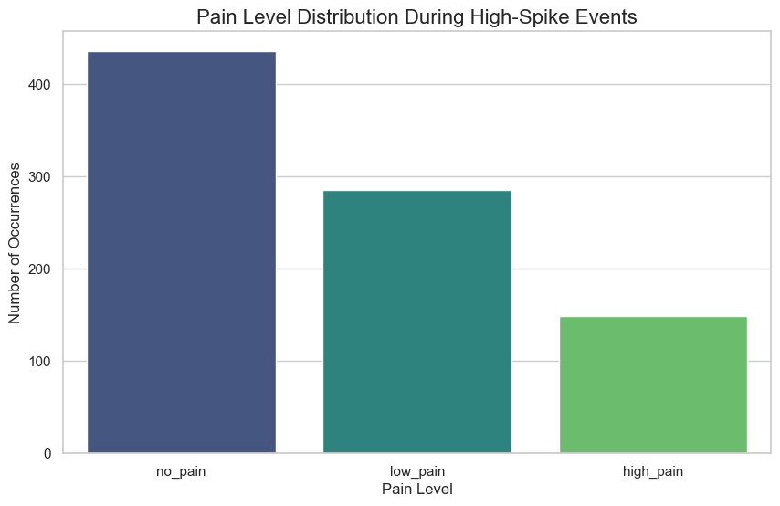
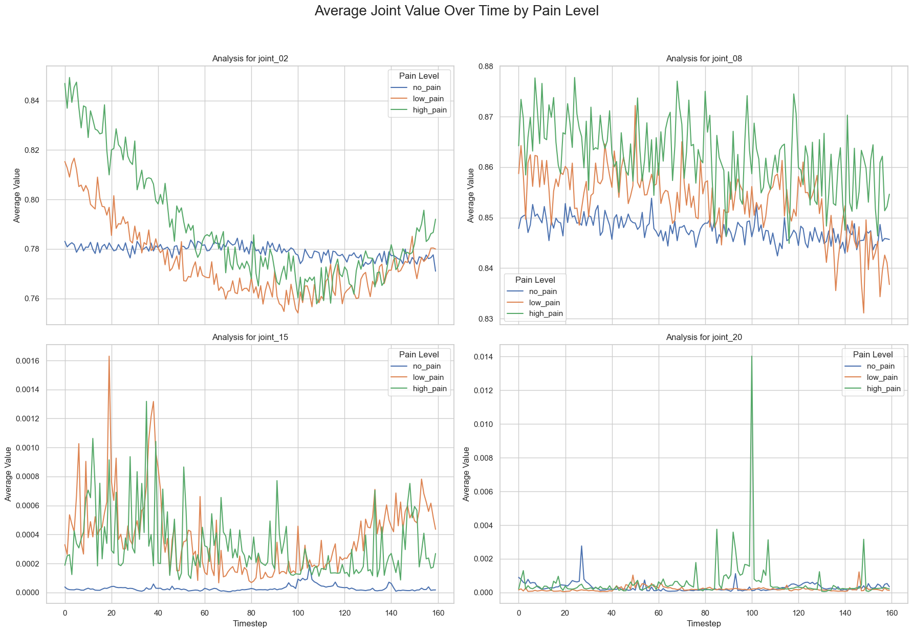
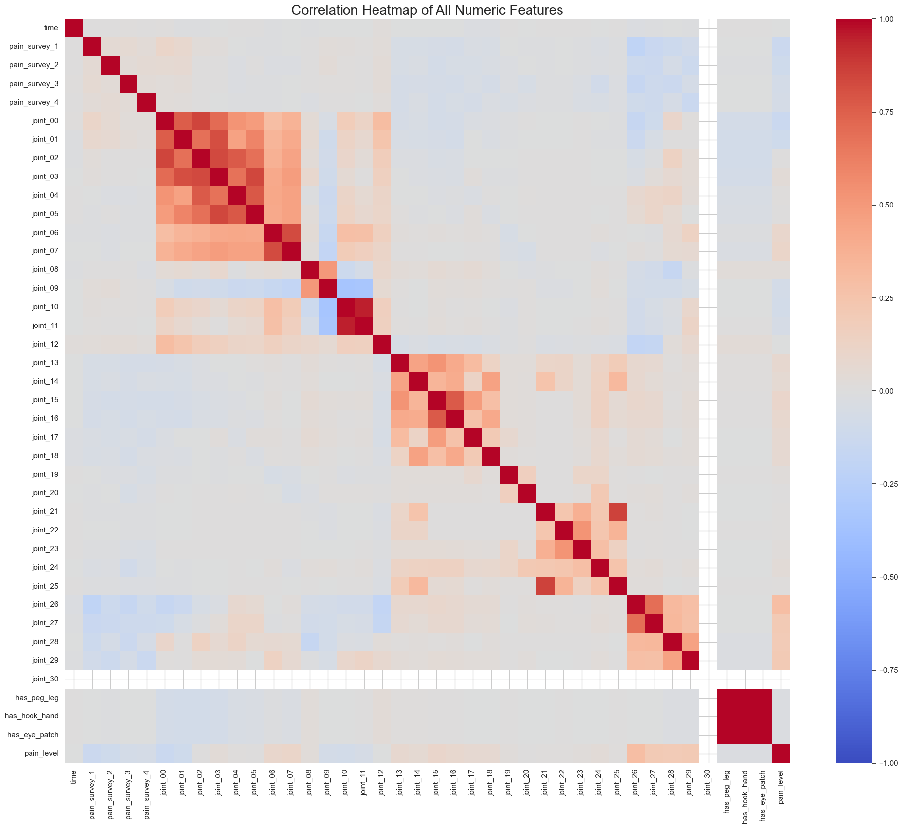
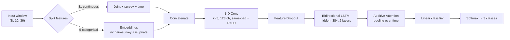
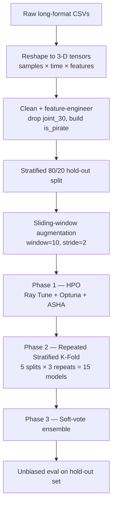

<div align="center">

# 🏴‍☠️ Pirate Pain — Time-Series Pain Classification

### Detecting pain levels from 31-joint motion-capture sequences with an attention-augmented Conv–Recurrent ensemble

[](https://www.python.org/)
[](https://pytorch.org/)
[](https://docs.ray.io/en/latest/tune/index.html)
[](https://scikit-learn.org/)
[](LICENSE)

**Best Kaggle F1: `0.960`  ·  Hold-out weighted F1: `~0.95`  ·  Hold-out accuracy: `0.96`**

<sub>🎓 Politecnico di Milano · *Artificial Neural Networks & Deep Learning* — First Challenge · Team <b>Reluminati</b><br/>📄 <a href="report/AN2DL_Challenge_Report.pdf">Read the full challenge report</a></sub>

</div>

---

## 📌 Overview

A multivariate **time-series classification** project: given a `160`-timestep recording of a subject's body — `31` joint sensors, `4` ordinal pain-survey responses, and static body attributes — predict whether each sequence reflects **`no_pain`**, **`low_pain`**, or **`high_pain`**.

The dataset is small, severely class-imbalanced (~77% `no_pain`, ~8% `high_pain`), and noisy. The solution leans on **careful EDA → principled preprocessing → a hybrid Conv-Recurrent-Attention model → a 15-model cross-validated ensemble** to squeeze a reliable, generalizable signal out of it.

> Built by **Team Reluminati** (Serkan Basaran, Margarita Makurina, Karim Negm, Muhammet Emre Eren) for the *Artificial Neural Networks & Deep Learning* First Challenge at **Politecnico di Milano**. Every modeling decision below traces back to a specific finding in the exploratory analysis — see the [full report](report/AN2DL_Challenge_Report.pdf).

---

## 🧭 Table of Contents

- [Results](#-results)
- [The Data Story (EDA)](#-the-data-story-eda)
- [Model Architecture](#-model-architecture)
- [Training Pipeline](#-training-pipeline)
- [Repository Structure](#-repository-structure)
- [Getting Started](#-getting-started)
- [Key Techniques](#-key-techniques-at-a-glance)

---

## 🏆 Results

Three ensembling strategies were benchmarked. The strongest — soft-voting over only the **best-performing (pruned) folds** — reached **0.960 Kaggle F1**. All hold-out figures come from a 67-sample test set held out *before* any HPO or training.

| Ensemble strategy | Validation F1 (mean ± std) | Kaggle F1 |
|---|:---:|:---:|
| 5-Fold average (90% train + hold-out) | 0.937 ± 0.008 | 0.949 |
| 5-Fold average (100% train) | 0.936 ± 0.021 | 0.957 |
| **3-Fold pruned average (best folds)** | **0.952 ± 0.010** | **0.960** |

<sub>Source: official challenge report, Table 1.</sub>

<div align="center">

<br><sub>Hold-out test set (67 samples) — one ensemble run, weighted F1 ≈ 0.95.</sub>
</div>

Even on the rare `high_pain` and `low_pain` classes the ensemble keeps precision high — every `low_pain` sample is recovered, and the residual error falls in the *safe* direction (rare-class confusion with `no_pain`, never the reverse). The honest weak spot, called out in the report, is **`high_pain` recall** on so few positive samples — the next lever would be stronger class-balancing (oversampling / harder focal weighting).

---

## 🔍 The Data Story (EDA)

The full investigation lives in [`data_analysis_notebook.ipynb`](data_analysis_notebook.ipynb). Highlights:

### 1. Severe class imbalance → Focal Loss
`no_pain` dominates the dataset. A naïve model can score ~77% accuracy by predicting it every time — so plain cross-entropy is the wrong objective. This directly motivated **Focal Loss** with class-balancing α-weights.

<div align="center">

</div>

### 2. "Rare jewels", not noise → dual scaling
Joints `13–25` are extremely right-skewed: almost always zero, with occasional sharp spikes. Rather than clipping them as outliers, EDA showed those **spikes are predictive** — during a high-spike event the odds of a pain label jump far above the ~23% baseline. They were preserved and **MinMax-scaled separately** from the well-behaved continuous features (StandardScaler).

<div align="center">

</div>

### 3. Class-separable temporal dynamics → recurrent model
Averaged joint trajectories separate cleanly by pain level over the 160-step window — there is genuine *temporal* structure to exploit, justifying a recurrent backbone over a static aggregate.

<div align="center">

</div>

### 4. Redundant & dead features → cleaned
- **`joint_30`** has zero variance (constant `0.5`) → **dropped**.
- `joint_10` and `joint_11` are ~95% correlated → redundant signal flagged.
- The prosthetic flags (`n_legs`, `n_hands`, `n_eyes`) are perfectly correlated (ρ = 1.0) → **collapsed into a single `is_pirate` indicator**.
- **ACF/PACF** decays almost immediately → motivates a **small sliding window (10) and stride (2)** for data augmentation instead of feeding full sequences.

<div align="center">

</div>

---

## 🧠 Model Architecture

A hybrid network that fuses learned embeddings for categorical signals, a 1-D convolutional front-end for local motifs, a bidirectional recurrent core for temporal context, and an attention head that pools the sequence into a single decision vector.



**Why each block:**
- **Per-feature embeddings** — the ordinal pain-survey answers and `is_pirate` flag are categorical; embeddings let the network learn their geometry instead of treating them as raw numbers.
- **1-D Conv (`same` padding)** — extracts short local motion motifs before the recurrence, acting as a learnable smoother over the noisy joints.
- **Bidirectional LSTM** — captures temporal dependencies in both directions (GRU vs. LSTM and uni/bi-directionality were left to the hyperparameter search; the winner was a 2-layer BiLSTM with hidden size 384).
- **Additive attention** — pools the variable-length recurrent output into a fixed context vector, letting the model *focus* on the informative timesteps (the spikes) rather than mean-pooling them away.

---

## ⚙️ Training Pipeline



| Stage | Tooling & choices |
|---|---|
| **Augmentation** | Sliding windows (`window=10`, `stride=2`) to multiply the small dataset |
| **Loss** | Focal Loss (γ ≈ 1.95) with class-balanced α-weights |
| **Optimizer** | AdamW + `OneCycleLR` schedule |
| **Speed** | Automatic Mixed Precision (AMP), `torch.compile`, gradient clipping |
| **HPO** | Ray Tune × Optuna search with the ASHA early-stopping scheduler |
| **Validation** | `RepeatedStratifiedKFold` (5×3) to smooth out unlucky splits on rare classes |
| **Inference** | Soft-vote average over the fold models; windows aggregated by mean |

> **Note on the project's evolution.** The submitted report describes a Conv1D-**GRU** trained with class-weighted cross-entropy and `CosineAnnealingLR`. The repository's final notebooks push beyond that baseline with a **Focal Loss** objective and an **attention** pooling head — two improvements the report itself flagged as future work — alongside a `OneCycleLR` schedule and a BiLSTM backbone.

---

## 📁 Repository Structure

```
.
├── main.ipynb                    # ⭐ Primary solution — robust 15-model K-fold ensemble (v13)
├── CH3.ipynb                     # Variant: class-imbalance strategy (WeightedRandomSampler + noise aug)
├── CH1.ipynb                     # Variant: final mean-aggregation submission (v17)
├── data_analysis_notebook.ipynb  # Full EDA, cleaning rationale, and diagnostics
├── report/                       # 📄 Formal challenge report (Politecnico di Milano)
├── assets/                       # Figures used in this README
├── environment.yml               # Conda environment (CUDA 12.1 / PyTorch)
├── requirements.txt              # pip alternative
└── README.md
```

> **Start with [`main.ipynb`](main.ipynb).** The `CH1` / `CH3` notebooks are alternative strategies kept for reference — they explore weighted sampling, noise augmentation, and different submission-aggregation schemes against the same model.

---

## 🚀 Getting Started

### Option A — Conda (recommended, GPU)

```bash
conda env create -f environment.yml
conda activate an2dl-kaggle
jupyter lab
```

### Option B — pip

```bash
python -m venv .venv && source .venv/bin/activate   # Windows: .venv\Scripts\activate
pip install -r requirements.txt
jupyter lab
```

### Data layout

The competition CSVs are git-ignored. Place them under `data/` before running:

```
data/
├── pirate_pain_train.csv
├── pirate_pain_train_labels.csv
└── pirate_pain_test.csv
```

Then open **`main.ipynb`** and run top-to-bottom. Trained fold models are written to `models/`, TensorBoard logs to `tensorboard/`, and Kaggle submissions to `submissions/`.

---

## 🧩 Key Techniques at a Glance

`Multivariate time-series classification` · `BiLSTM / GRU` · `1-D CNN feature extraction` · `Additive attention` · `Categorical embeddings` · `Focal Loss for imbalance` · `Sliding-window augmentation` · `Repeated Stratified K-Fold ensembling` · `Ray Tune + Optuna HPO` · `Mixed-precision (AMP) training` · `torch.compile`

---

<div align="center">
<sub>Team <b>Reluminati</b> — Serkan Basaran · Margarita Makurina · <a href="https://github.com/Negm2000">Karim Negm</a> · Muhammet Emre Eren<br/>Politecnico di Milano · Licensed under MIT</sub>
</div>
